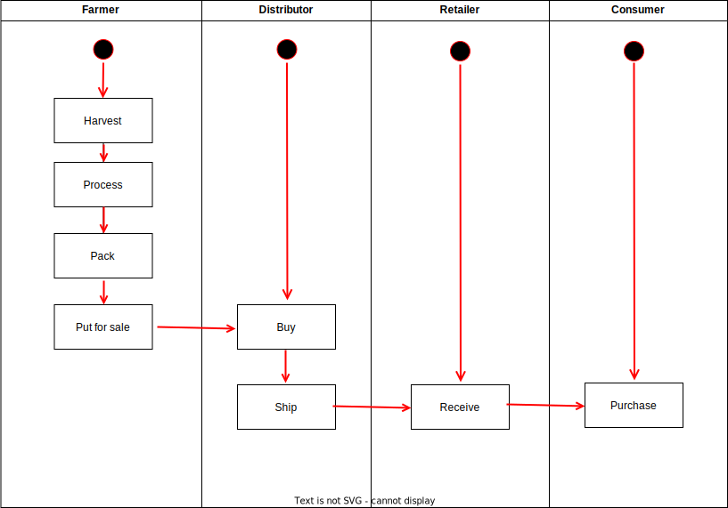
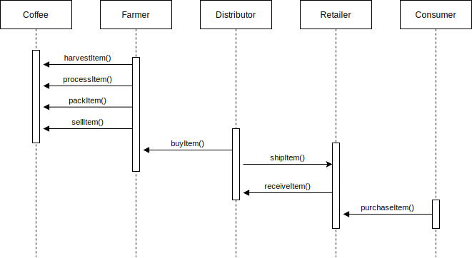
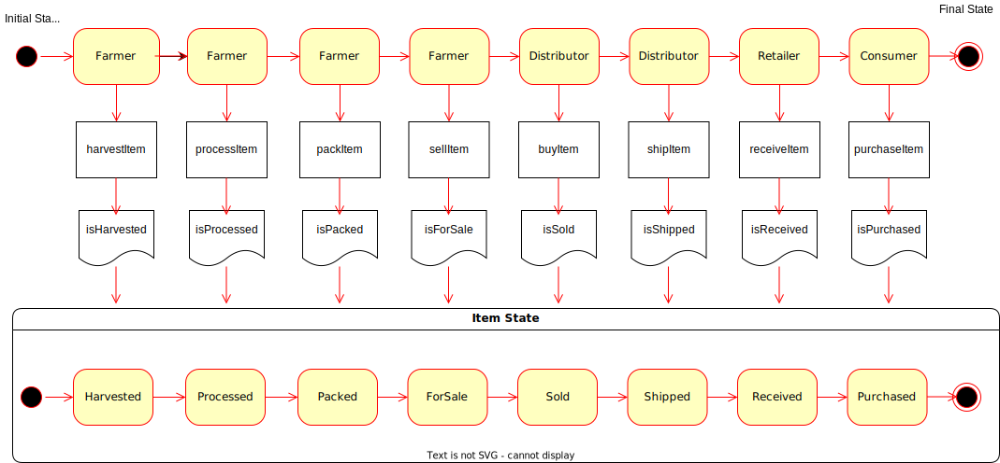
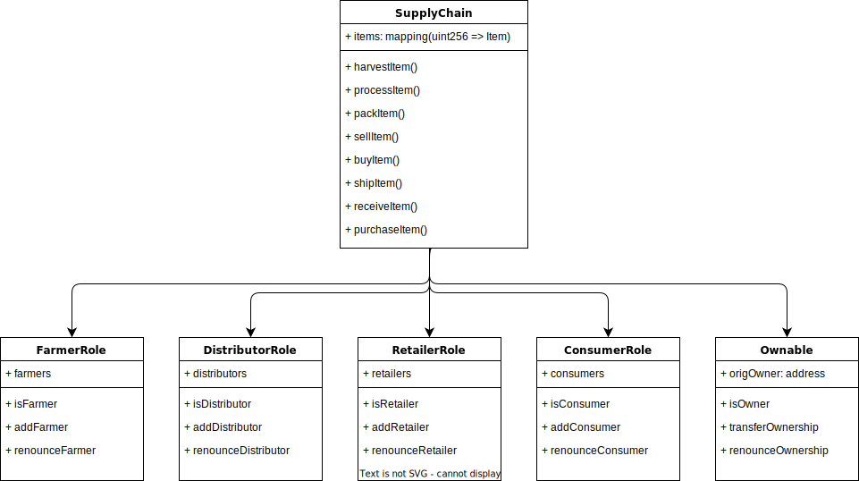

# Supply chain & data auditing

This repository containts an Ethereum DApp that demonstrates a Supply Chain flow between a Seller and Buyer. The user story is similar to any commonly used supply chain process. A Seller can add items to the inventory system stored in the blockchain. A Buyer can purchase such items from the inventory system. Additionally a Seller can mark an item as Shipped, and similarly a Buyer can mark an item as Received.

- Truffle version = Truffle v5.1.14-nodeLTS.0 (core: 5.1.13)
- Solidity version = v0.5.16 (solc-js)
- Node version = Node v12.22.9
- Ganache version = v2.5.4
- Web3 version = ^1.3.5
- Contract: https://rinkeby.etherscan.io/address/0x5A676e81272DaCD49d843cd2FfC2c85Fee1E3BC1
- Txn: https://rinkeby.etherscan.io/tx/0x52ae3088d22151a3aa3a9bcdca2a4c05ca52b537d99d5fb316ff7f32235c3f40

### Interfaces

- AccessControl - Collection of Contracts: These contracts manages the various addresses and constraints for operations
  that can be executed only by specific roles.
- Base - SupplyChain.sol: This is where we define the most fundamental code shared throughout the core functionality.
  This includes our main data storage, constants and data types, plus internal functions for managing these items.
- Core - Ownable.sol: is the contract that controls ownership and transfer of ownership.

#### Prerequisites
- Ganache
- truffle
- Metamask
- run `npm install`

#### Contracts build

Start Ganache with this mnemonic "spirit supply whale amount human item harsh scare congress discover talent hamster"

`truffle compile`

`truffle migrate`

#### Run web app

`npm run dev`

#### Contracts Testing

`truffle test`

### Deploy To Rinkeby
We need `truffle-hdwallet-provider` to add a new config in `truffle-config.js` for the Rinkebt network.
Then we can run:
`truffle migrate --reset --network rinkeby `

### UML Diagrams
#### Activity Diagram

#### Sequence Diagram

#### State Diagram

#### Data Model

